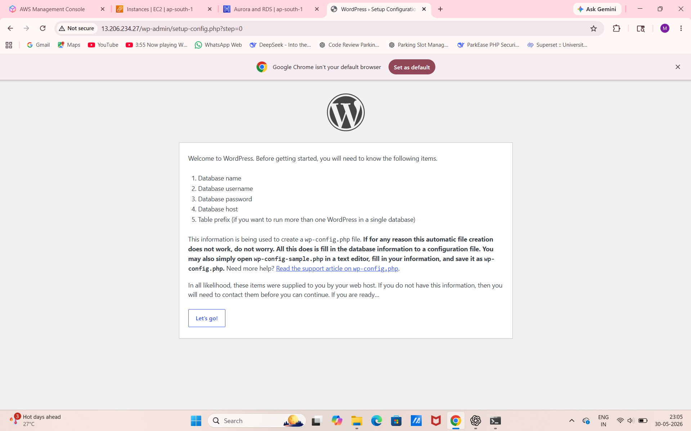

# AWS 3-Tier Architecture Deployment Project

## Project Overview

This project demonstrates the deployment of a Java-based web application using a secure and scalable 3-Tier Architecture on AWS.

The architecture separates the application into three layers:

* **Web Tier** – Nginx Reverse Proxy Server
* **Application Tier** – Apache Tomcat Server hosting the Java application
* **Database Tier** – Amazon RDS MySQL Database

This design improves security, scalability, and maintainability by isolating each component into dedicated tiers.

---

## Architecture

```text
Internet
    |
Nginx Web Server
    |
Tomcat Application Server
    |
Amazon RDS MySQL
```

---

## AWS Services Used

* Amazon VPC
* Public and Private Subnets
* Internet Gateway
* NAT Gateway
* Amazon EC2
* Amazon RDS MySQL
* Security Groups
* Route Tables
* Elastic IP

---

## Architecture Components

### Web Tier

* Nginx Reverse Proxy Server
* Hosted in Public Subnet
* Receives client requests and forwards them to the Application Tier

### Application Tier

* Apache Tomcat Server
* Deploys Java WAR Application
* Hosted in Private Subnet
* Accessible only from Web Tier

### Database Tier

* Amazon RDS MySQL
* Hosted in Private Subnet
* Accessible only from Application Tier

---

## Networking Configuration

### VPC

```text
10.0.0.0/16
```

### Public Subnet

```text
10.0.1.0/24
```

### Private Application Subnet

```text
10.0.2.0/24
```

### Private Database Subnet

```text
10.0.3.0/24
```

---

## Security Configuration

### Nginx Security Group

| Type | Port | Source    |
| ---- | ---- | --------- |
| HTTP | 80   | 0.0.0.0/0 |
| SSH  | 22   | My IP     |

### Tomcat Security Group

| Type       | Port | Source               |
| ---------- | ---- | -------------------- |
| Custom TCP | 8080 | Nginx Security Group |
| SSH        | 22   | Bastion Host / My IP |

### RDS Security Group

| Type  | Port | Source                |
| ----- | ---- | --------------------- |
| MySQL | 3306 | Tomcat Security Group |

---

## Deployment Steps

### Step 1: Create VPC

Create a custom VPC with CIDR block:

```text
10.0.0.0/16
```

---

### Step 2: Create Subnets

Create:

* Public Subnet (Web Tier)
* Private Application Subnet
* Private Database Subnet

---

### Step 3: Create Internet Gateway

Attach Internet Gateway to VPC.

---

### Step 4: Configure Route Tables

#### Public Route Table

| Destination | Target           |
| ----------- | ---------------- |
| 10.0.0.0/16 | Local            |
| 0.0.0.0/0   | Internet Gateway |

#### Private Route Table

| Destination | Target      |
| ----------- | ----------- |
| 10.0.0.0/16 | Local       |
| 0.0.0.0/0   | NAT Gateway |

---

### Step 5: Launch Nginx Server

Install Nginx:

```bash
sudo yum update -y
sudo yum install nginx -y
sudo systemctl enable nginx
sudo systemctl start nginx
```

Configure Reverse Proxy:

```nginx
server {
    listen 80;

    location / {
        proxy_pass http://<Tomcat-Private-IP>:8080/student/;
    }
}
```

Restart Nginx:

```bash
sudo systemctl restart nginx
```

---

### Step 6: Launch Application Server

Install Java:

```bash
sudo yum install java -y
java --version
```

Install Apache Tomcat and start service.

Deploy application:

```bash
curl -O https://s3-us-west-2.amazonaws.com/studentapi-cit/student.war
```

Place WAR file inside:

```text
/opt/tomcat/webapps/
```

---

### Step 7: Create Amazon RDS MySQL

Database Configuration:

| Setting       | Value     |
| ------------- | --------- |
| Engine        | MySQL     |
| Deployment    | Single AZ |
| Public Access | No        |

---

### Step 8: Create Database

Connect to MySQL:

```bash
mysql -h <RDS-ENDPOINT> -u admin -p
```

Create database:

```sql
CREATE DATABASE studentapp;
```

Create table:

```sql
CREATE TABLE IF NOT EXISTS students (
student_id INT NOT NULL AUTO_INCREMENT,
student_name VARCHAR(100),
student_addr VARCHAR(100),
student_age VARCHAR(3),
student_qual VARCHAR(20),
student_percent VARCHAR(10),
student_year_passed VARCHAR(10),
PRIMARY KEY(student_id)
);
```

---

### Step 9: Configure JDBC Connector

Download MySQL Connector:

```bash
curl -O https://s3-us-west-2.amazonaws.com/studentapi-cit/mysql-connector.jar
```

Add datasource configuration in:

```text
/opt/tomcat/conf/context.xml
```

Configure:

```xml
<Resource name="jdbc/TestDB"
          auth="Container"
          type="javax.sql.DataSource"
          username="admin"
          password="password"
          driverClassName="com.mysql.jdbc.Driver"
          url="jdbc:mysql://<RDS-ENDPOINT>:3306/studentapp"/>
```

---

### Step 10: Restart Tomcat

```bash
cd /opt/tomcat/bin

./catalina.sh stop
./catalina.sh start
```

---

## Application Testing

Access application through:

```text
http://<Nginx-Public-IP>
```

Submit student details through the application form.

Verify records in MySQL database:

```sql
SELECT * FROM students;
```

---
## Screenshots
### 1. VPC Creation
This screenshot shows the creation of a custom VPC with public and private subnets.


### 2. Nginx Configuration
Nginx configured as a reverse proxy in the Web Tier.

### 3. Tomcat Deployment
Apache Tomcat deployed in the Application Tier to host the Java application.

### 4. RDS Database Creation
Amazon RDS MySQL database instance created in the Database Tier.

### 5. Application Output
Successful execution of the application through the browser.

### 6. Database Verification

Successful database connection established between the application and Amazon RDS MySQL database instance.

## Key Features

* Secure 3-Tier Architecture
* Network Isolation
* Reverse Proxy Configuration
* Private Database Access
* Application-to-Database Connectivity
* Security Group-Based Access Control
* Scalable AWS Infrastructure### 5. Application Output

---

## Learning Outcomes

* AWS VPC Design
* EC2 Administration
* Nginx Reverse Proxy
* Apache Tomcat Deployment
* Amazon RDS MySQL
* Security Group Configuration
* Application Connectivity
* Three-Tier Architecture Design

---
---

## Conclusion

This project successfully demonstrates the implementation of a secure and scalable 3-Tier Architecture on AWS using Nginx, Apache Tomcat, and Amazon RDS MySQL.

By separating the Web, Application, and Database layers into different tiers, the architecture improves security, maintainability, and scalability. Security Groups, private subnets, and controlled network access ensure that each component communicates securely within the VPC.

Through this project, I gained hands-on experience with AWS networking, EC2 administration, Nginx reverse proxy configuration, Tomcat deployment, RDS database management, and end-to-end application connectivity in a production-like cloud environment.

This architecture serves as a strong foundation for deploying enterprise-grade applications on AWS.

---
## Author

**Mayur Khaire**

Cloud Engineer | AWS | Linux | Networking | DevOps

LinkedIn: https://www.linkedin.com/in/mayur-khaire-972734377
